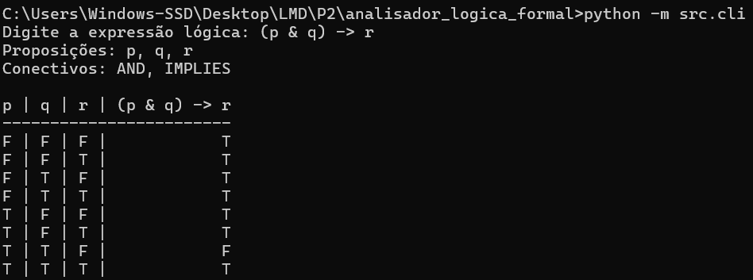
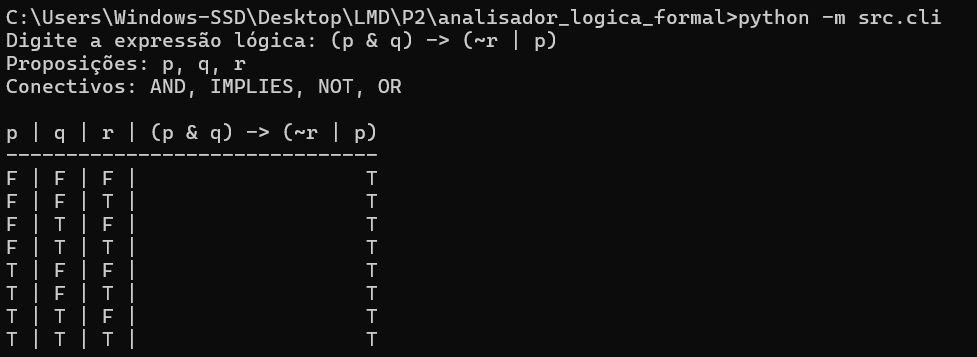

<p align="center">
  
</p>

<p align="center">
  <strong>Universidade Federal do Maranhão</strong><br>
  <strong>Centro de Ciências Exatas e Tecnologias</strong><br>
  <strong>Curso de Engenharia da Computação</strong><br>
  <strong>Disciplina: Lógica e Matemática Discreta</strong><br>
  <strong>Professor: Rondineli Seba</strong><br><br>
  <strong>Discentes:</strong><br>
  <strong>Renata Costa Rocha</strong> — Matrícula: 20240001556<br>
  <strong>Raphael Câmara Sá</strong> — Matrícula: 20240001547
</p>

<hr>

<p align="center">
  <em>
    Este projeto foi desenvolvido como parte das atividades avaliativas da disciplina de 
    <strong>Lógica e Matemática Discreta</strong>, do curso de Engenharia da Computação 
    da Universidade Federal do Maranhão.
    <br><br>
    O objetivo consiste na implementação de um analisador automatizado de sentenças 
    lógicas, fundamentado nos princípios formais da <strong>Lógica Proposicional</strong> 
    e da <strong>Lógica de Predicados</strong>, por meio do desenvolvimento de um sistema 
    computacional em Python.
    <br><br>
    O desenvolvimento do código, aliado à documentação técnica apresentada neste 
    repositório, compõe a avaliação prática da disciplina.
  </em>
</p>

---

<p align="center">
  
  
  
</p>

---

# 1. Descrição do Projeto

Este repositório apresenta a implementação de um **Analisador de Lógica Formal,** capaz de:

- Identificar automaticamente proposições atômicas;
- Mapear conectivos lógicos;
- Construir a estrutura sintática da expressão (AST – *Abstract Syntax Tree*);
- Gerar a Tabela-Verdade completa, contendo 2ⁿ combinações possíveis;
- Expandir fórmulas da Lógica de Predicados em domínio finito.

O sistema foi desenvolvido em **Python,** adotando estrutura modular e princípios de organização de software.

---

# 2. Objetivos

O projeto tem como objetivos principais:

- Aplicar formalmente os fundamentos da Lógica Proposicional;
- Implementar parsing sintático respeitando precedência de operadores;
- Automatizar a geração de Tabelas-Verdade;
- Implementar expansão de quantificadores da Lógica de Predicados;
- Desenvolver código modular, validado e estruturado;
- Produzir documentação técnica alinhada à fundamentação teórica.

---

# 3. Especificação do Problema

O programa recebe como entrada uma sentença lógica em **formato restrito,** evitando ambiguidades da linguagem natural.

## 3.1 Lógica Proposicional

São aceitos:

- Proposições atômicas: `p`, `q`, `r`, `p1`, etc.
- Conectivos:
  - Negação: `~`
  - Conjunção: `&`
  - Disjunção: `|`
  - Implicação: `->`
  - Bicondicional: `<->`
- Parênteses: `(` e `)`

### Exemplo

```

(p & q) -> (~r | p)

```

---

## 3.2 Lógica de Predicados

O sistema aceita fórmulas com quantificadores sob restrições formais:

- Quantificadores: `forall x.` e `exists x.`
- Variáveis: letras minúsculas (`x`, `y`, `z`)
- Predicados: letras maiúsculas com argumentos, por exemplo:
  - `P(x)`
  - `Q(x,a)`
  - `R(a,b)`

### Domínio Finito

Para permitir a avaliação computacional via Tabela-Verdade, os quantificadores são expandidos em um domínio finito predefinido:

```

Domínio = {a, b}

```

### Expansão Formal

- ∀x φ(x)  →  φ(a) ∧ φ(b)
- ∃x φ(x)  →  φ(a) ∨ φ(b)

Após a expansão, a fórmula torna-se proposicional e pode ser avaliada pelo sistema.

### Exemplo

Entrada:

```

exists x. (P(x) -> Q(x))

```

Expressão expandida:

```

((p_a -> q_a) | (p_b -> q_b))

```

---

# 4. Fundamentação Teórica

A implementação fundamenta-se nos seguintes conceitos formais:

- Proposição atômica;
- Conectivos lógicos (¬, ∧, ∨, →, ↔);
- Regras de precedência;
- Avaliação semântica de fórmulas;
- Quantificação universal e existencial;
- Geração de Tabelas-Verdade com 2ⁿ combinações possíveis.

O algoritmo de parsing utiliza o método **Shunting-yard,** garantindo a correta hierarquia operacional.

A expansão de predicados em domínio finito permite compatibilizar Lógica de Primeira Ordem com avaliação proposicional computacional.

---

# 5. Organização do Código

```

src/
├── tokenizer.py
├── parser.py
├── ast_nodes.py
├── evaluator.py
├── truth_table.py
├── predicate_expand.py
└── cli.py

````

### Responsabilidades

- `tokenizer.py` → análise léxica;
- `parser.py` → construção da AST;
- `ast_nodes.py` → estrutura formal da árvore sintática;
- `evaluator.py` → avaliação semântica;
- `truth_table.py` → geração da Tabela-Verdade;
- `predicate_expand.py` → expansão de quantificadores;
- `cli.py` → interface de execução.

---

# 6. Execução do Programa

## Pré-requisitos

- Python 3.x
- Terminal (CMD, PowerShell ou VS Code)

## Execução

```bash
git clone https://github.com/ahcorataner/analisador_logica_formal.git
````

```bash
cd analisador_logica_formal
```

```bash
python -m src.cli
```

---

# 7. Exemplos de Execução

## 7.1 Proposicional

Entrada:

```
(p & q) -> r
```

Saída:

* Proposições identificadas;
* Conectivos utilizados;
* Tabela-Verdade completa.

---

## 7.2 Predicados

Entrada:

```
forall x. P(x)
```

Saída:

```
(p_a & p_b)
```

Seguida da Tabela-Verdade correspondente.

---

# 8. Demonstração Visual da Execução

## 8.1 Execução – Lógica Proposicional

<p align="center">
  
</p>

---

## 8.2 Execução – Lógica de Predicados

<p align="center">
  
</p>

---

# 9. Validação e Tratamento de Erros

O sistema valida:

* Parênteses desbalanceados;
* Operadores em posições inválidas;
* Caracteres não reconhecidos;
* Expressões mal formadas;
* Uso incorreto de quantificadores.

---

# 10. Considerações Finais

O projeto integra rigor matemático e implementação computacional, demonstrando a aplicabilidade prática dos fundamentos da Lógica Formal na Engenharia da Computação.

A abordagem adotada garante clareza estrutural, modularização e coerência teórica.

---

# 11. Licença

Projeto de finalidade exclusivamente acadêmica, desenvolvido no contexto da disciplina de Lógica e Matemática Discreta da UFMA.

---

# 12. Contato

* **Renata Costa Rocha** — [renata.rocha@discente.ufma.br](mailto:renata.rocha@discente.ufma.br)
* **Raphael Câmara Sá** — [raphael.sa@discente.ufma.br](mailto:raphael.sa@discente.ufma.br)

````


